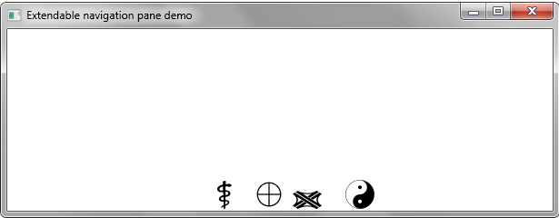

ExtendableNavigation
====================

This small project implements an extendable navigation pane in JavaFX. This pane has four buttons with icons in it with. At first, only the icon of each button is shown. By mouseover, the pane expands and shows the button texts. One button can then be choosen and is highlighted with a drop shadow.

Starting condition: All buttons displaying without text.

MouseOver: Buttons have more padding and show text.

After selecting a button, this button is highlighted in collapsed mode.

This project is just a prototype and doesn't have the best code styling and architecture. Just copy what you need and don't laugh. ;)
